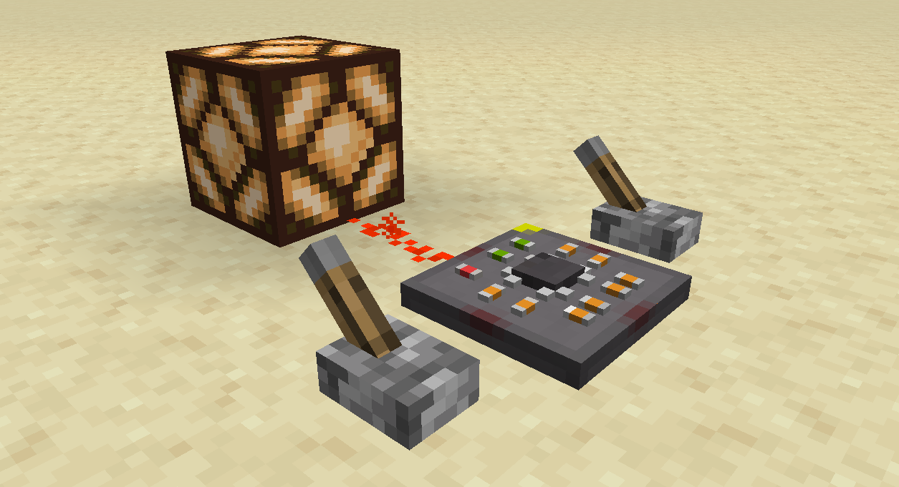
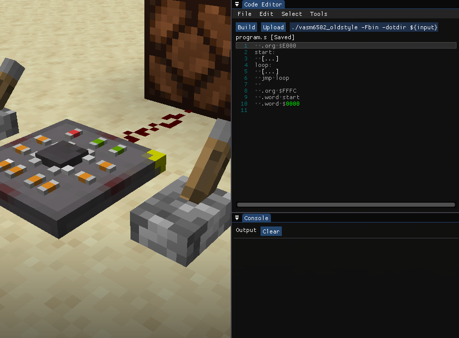
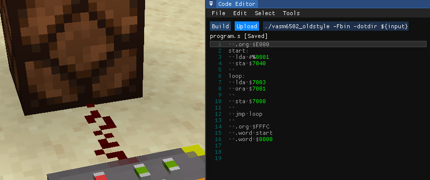

# Getting Started

One of the simplest ways to get started is by using the [Nano](./microcontrollers/nano.md) microcontroller. It is the cheapest microcontroller that has the least amount of memory and pins. It is a great way to learn the basics of assembly programming and how to interact with the GPIO pins.



We are going to make this microcontroller act as a simple logic **OR** gate. We will use the GPIO pins to read the input and output the result to another pin.

## Acquire the Nano

To get started, you need to acquire the Nano microcontroller. Currently, the only way to get it is by using the `/give` command. You can use the following command to get the Nano:


## Boilerplate Code

Right click the Nano to open the **IDE Screen**. On the top right, you'll find the *Code Editor* window. This is where you can write your assembly code.



You'll need to write boilerplate code to setup the processor's vectors and starting location. It will also include the `start` and `loop` sections of the code.

```asm
  .org $E000 ; Start of the program memory
start:
  [...]
loop:
  [...]
  jmp loop ; Jump back to the loop
  
  .org $FFFC ; Near the end of the program memory
  .word start ; Reset vector
  .word $0000 ; Interrupt vector (not used)
```
## Setup the GPIO Pins

We are going to use the front pin as the output of the OR gate. The left and right pins will be the inputs.

For this case, we need to set the pins' directions by setting the `GPIODIR0` register. We write the binary value `0001` to the register to set the front pin as an output and the rest as inputs.

```asm
start:
  lda #%0001
  sta $7040 ; GPIODIR0
```
### Quick Syntax Explanation
We are using the *old_style* syntax for the assembly code, and it is used commonly for the 6502. Here are some quick syntax explanations:

* The `#` symbol is used to denote an immediate value. This means that the value is a constant and not a memory address.
* The `%` symbol is used to denote a binary value. This means that the value is in binary format.
* The `$` symbol is used to denote a hexadecimal value. This means that the value is in hexadecimal format.

## Read the Input Pins
Before we can perform the OR operation, we need to read the input pins. Since the `ORA` instruction uses the `A` register and a value in memory as inputs, we will just need to store one of the pin's value in the `A` register (left pin in this case).

```asm
loop:
  lda $7003 ; GPIOPV3 (Left pin)

  jmp loop
``` 

We will do this in the `loop` section of the code so that it works continuously.

## Run the `ORA` Operation
We will perform the OR operation between the `A` register and the right pin's value. The result will be stored in the `A` register.

```asm
loop:
  lda $7003
  ora $7001 ; OR with GPIOPV1 (Right pin)

  jmp loop
```

## Set the Output Pin
Finally, we will write the result of the OR operation to the front pin.

```asm
loop:
  lda $7003 
  ora $7001

  sta $7000 ; GPIOPV0 (Front pin)

  jmp loop
```

## Upload the Code
Once you have written the code, you can upload it to the Nano by clicking the *Upload* button on the top right of the *Code Editor* window.



## Result
As soon as you upload the code, the microcontroller will start executing the code. You can see the result by looking at the front pin. It should output the result of the OR operation between the left and right pins.


Full code:
```asm
  .org $E000 ; Start of the program memory
start:
  lda #%0001
  sta $7040 ; GPIODIR0
  
loop:
  lda $7003
  ora $7001
  
  sta $7000 ; GPIOPV0
  
  jmp loop ; Jump back to the loop
  
  .org $FFFC ; Near the end of the program memory
  .word start ; Reset vector
  .word $0000 ; Interrupt vector (not used)
```

## Conclusion
This is a simple example of how you can use the Nano microcontroller to perform logic operations. You can experiment with different operations and modules to create more complex circuits. Have fun coding!

## Next Steps
Read more about the [Nano microcontroller](./microcontrollers/nano.md) and its modules to explore more possibilities. You can also check out the [resources](./resources.md) section for more information on the 6502 instruction set and other useful resources.