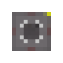

# Microcontrollers

This mod has a few microcontrollers that you can use to automate your redstone contraptions. They are based on the **mos6502** microcontroller, which is popular choice for hobbyists and educators.

**Note**: The mod is in its early stages, so there are only a few microcontrollers available. More will be added in the future.

|  | Microcontroller | Description |
| --- | --- | --- |
|  | [**Nano**](./nano.md) | The cheapest microcontroller that has the least amount of memory and pins. |