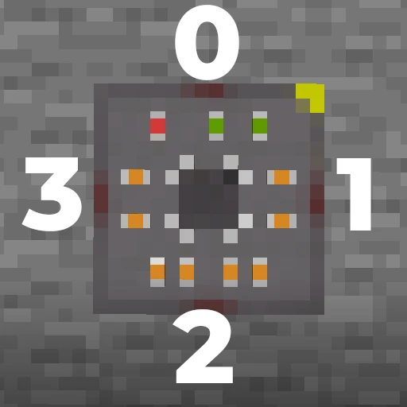

# Nano Microcontroller

<p style="text-align: center">
    
</p>

The cheapest microcontroller that has the least amount of memory and pins. Great for simple projects that don't require a lot of resources.

## How to Acquire

Currently, there is no crafting recipe for the Nano, and it is not accesible in the creative inventory. It can be spawned in using the `/give` command.

```
/give <your_username> cnmcu:nano
```

## Specs

| Spec | Value | Unit | Usage |
| --- | --- | --- | --- |
| CPU | mos6502| | |
| Clock Speed | 800 | Hz | |
| ROM | 8096 | Bytes | Program Code, Vectors, LUTs |
| RAM | 512 | Bytes | 256B ZeroPage, 256B Stack Memory |
| Pins | 4 | | |

## Pinout

Pins are numbered from `0` to `3`, and they ordered in a clockwise fashion starting from the top and ending at the left. Note that the top right yellow corner of the block indicates the orientation of the pins. They are also labeled in order: *front*, *right*, *back*, and *left*.

<p style="text-align: center">
    
</p>

## Address Map

The Nano has a 64KB address space, with 8KB of ROM and 512 bytes of RAM.

| Address Range | Name | Uses |
| --- | --- | --- |
| `0x0000` - `0x0200` | RAM | 256 bytes zero page memory \| 256 byte stack |
| `0x7000` - `0x7070` | GPIO | Pin Control/Interrupts |
| `0xE000` - `0x10000` | ROM | Program Code, Vectors, LUTs |

## Modules

* [GPIO](../modules/gpio.md) - Control and read the state of the pins of a microcontroller via the processor's data bus. It has a buffer of `64` bytes to store the state of every pin, but only the first four are used by the pin drivers.

## Registers

Head to this page to see the registers available in the Nano microcontroller: [Nano Registers](../registers/nano.md)